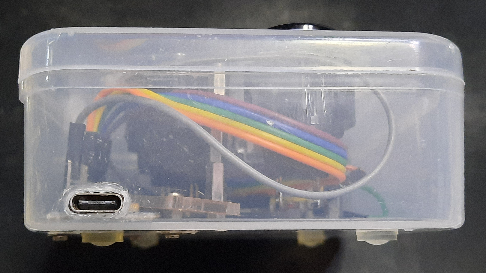

# Zok's ArcBtnBox
This is a handwired 5 (or 3) button arcade button controller that I made out of a random plastic box.

The internal dimensions of the box are about 80mm D x 110mm W x 33mm H.

The controller was designed to use 5 buttons, but I only had 3 24mm buttons on hand, so it is what it is for now.

An Arduino Pro Micro type C variant was used with direct pin connection and internal pull-up resistors.

## Bill of Materials
| Part                         | Details        | Quantity | Notes                                   |
|------------------------------|----------------|----------|-----------------------------------------|
| Sanwa arcade buttons         | 24mm           | 5 (or 3) | Commonly available variant has [SW-68 switches](https://github.com/Zokhoi/Arcade-Switches/blob/master/doc/Switches.md#sanwa-sw-68),  which uses 2.8mm lug connectors (#110タブ) |
| Arduino Pro Micro            | Type C variant | 1        | I hate micro B connector with a passion |
| Arduino Pro Micro headers    | 12-pin header  | 1        | Only one side of the microcontroller needs to be soldered with header       |
| DuPont wires                 | Male-female    | Number of arcade buttons plus  1 | For connecting pins of microcontroller to buttons   |
| DuPont wires                 | Male-male      | Number of arcade buttons minus 1 | For connecting one leg each of all buttons together |
| M2 screws                    |  4mm length    | 9        |                                         |
| M2 washer                    |                | 9        |                                         |
| M2 standoffs                 |  ↓             | ↓        | All standoffs with male side have 4mm head length                           |
| M2 standoffs - Female-female |  3mm length    | 9        | For securing microcontroller and assembling 33mm support pillars            |
| M2 standoffs - Male-female   |  4mm length    | 5        | For assembling 33mm support pillars     |
| M2 standoffs - Female-female |  6mm length    | 5        | For assembling 33mm support pillars     |
| M2 standoffs - Male-female   | 10mm length    | 10       | For assembling 33mm support pillars     |
| Rubber feet                  |                | 4        | Make sure that the feet is higher than screw head + washer                  |

For 33mm support pillars with female-female ends, this is how I assemble them:  
|========|----  |========|----  |=|  |====|  ----|==|  
10mm F-M,  10mm F-M,  3mm F-F,  6mm F-F,  4mm M-F  
Five support pillars are used in my design to offset the force hitting on the arcade buttons.

## Assembly

Some tips:
* 33mm is just barely deeper than commonly available Sanwa 24mm arcade buttons using SW-68 switches.
* The top plastic cover of the box measures about 1mm thick, which is usable for the arcade buttons requiring 1.2mm thick mounting plate.
* Be careful drilling holes on plastic box as it might crack. Safer to use soldering iron to melt holes and then clean up the melted plastic using a utility knife with a long blade.
* For all the screw holes, use the screws with washers to distribute the pressure around the plastic plate, instead of relying on the screw head.
* Choose a suitable length of DuPont wires with enough slack to route the wires, but not too much that it becomes hard to contain all the wires in the box. I used 20cm wires but 10cm might have worked better.

Top design:  

For the top, basically you need to make holes for the arcade buttons of about 25mm diameter, as 24mm would be too tight of a fit.

Then at the corner between each button, make a hole for screws to secure the support pillar.

For the bottom, choose one side that you can place the microcontroller without it touching anything (generally bottom left or right).

On the wall of the side you have chosen, make a hole for the microcontroller USB port to fit into.

Then make four holes for securing extra standoffs that would keep the microcontroller in place.

If you would like the box to be extra secure, you can make 5 more holes and screw in the support pillars on the underside. You would need 5 more M2 screws and washers each.

For connecting the microcontroller, you should only solder one side of the microcontroller with header. The header retainer thing can be pushed down to make the header sit flush with the microcontoller's back side, so the microcontroller can sit flat in the box.

Then, connect one leg each of all the arcade buttons together by soldering the male-male DuPont wires, and solder the male side of one male-female DuPont wire to the connected legs. The female connector then go on the controller's ground pin.

After that, solder the remaining male-female DuPont wires with male side to each of the remaining legs on the arcade buttons. The female side go on the data pins on the microcontroller.

For my configuration, the five buttons labelled 1 to 5 uses the leftmost 5 data pins on the header, which are pins 10, 16, 14, 15 and A0 respectively. As there are physically only 3 buttons that I have installed, pins 10 and A0 are connected to a wire but the other end of the wire stays hanging.